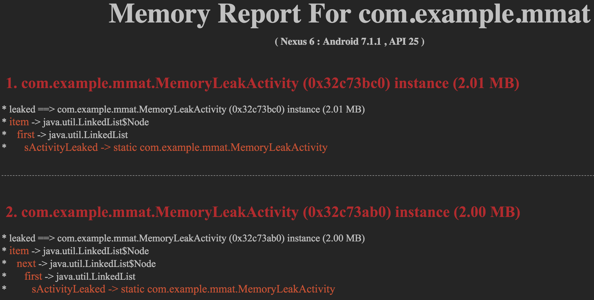

#  MMAT 自动化内存分析工具

在开发Android App过程中我们通常使用`LeakCanary`进行内存泄漏检测, 它基本原理是在App运行时检测Activity、Fragment是否产生内存泄漏, 如果有内存泄漏则进行dump hprof, 然后分析该泄漏的GC ROOT, 最终通过通知栏通知用户内存泄漏的情况. 这种方式能够在开发app时简单、有效地找出内存泄漏.

但是由于`LeakCanary`是app运行时发现泄漏之后立即dump 内存快照，并且实时进行分析数据, 而由于移动设备的计算能力有限, 导致使用`LeakCanary`并不能在运行时分析出所有内存泄漏，例如当`LeakCanary`正在分析一次内存泄漏时又产生了另外的内存泄漏, 而在LeakCanary分析完所有内存泄漏时用户可以退出app. 

因此需要另外一种`补充机制`, 能够在App运行结束之后进行全面、自动地离线分析app内存泄漏情况, 一次性分析出本次App运行产生的所有Activity、Fragment的内存泄漏, 那么将会让内存泄漏分析更加全面、高效.

MMAT就是为了解决这个问题, 它的核心思路是用户在操作完app (可以是用户自己操作，也可以通过运行monkey进行随机操作)之后，通过`adb shell`命令将app退回到主页面, 然后再退回桌面 (此时应用的Application 还存在, 但是所有页面都应该被销毁, app处于后台状态). 此时如果没有产生内存泄漏, 那么被测试的App中就不会存在Activity、Fragment的实例;然后再dump 内存快照到pc上通过MMAT进行离线分析, 最终得到内存泄漏的完整报告. 


## 一、MMAT 工作流程 

1. 如果有配置monkey测试命令, 则执行monkey测试 (monkey测试会使得App会随机进入各种Activity, 这种压力测试也容易产生内存泄漏; 当然自己手动操作App, 然后退到后台, 再运行mmat(禁用monkey测试)进行检测也可以)
	* 1.1 执行monkey测试 (可禁用)
	* 1.2 回到app 主页面 
	* 1.3 将app退到后台, 回到手机桌面	
	* 1.4 执行app的force gc (需要手机是root)
2. dump hprof内存快照
3. 分析hprof, 得到所有Activity、Fragment泄漏的记录以及超过一定大小的Bitmap文件
4. 将分析结果输出为html报告


## 二、使用MMAT

> 注意: 因为MMAT在通过monkey操作app后会使用 adb 命令dump应用的内存信息, 因此如果你需要dump release版的app的内存信息, 请确保你的app在测试时可调试的 (**风险提示: 建议只在测试时开启debuggable=true, 对外发布的apk不要设置为true**), 
即需要在 AndroidManifest.xml 的 application 节点中添加 `android:debuggable="true"`.

使用MMAT有两种方式, 请参考 [1.1章节](#mmat-plugin) 和 [1.2章节](#mmat-jar)


<span id='mmat-plugin'></span>
### 1.1 通过 gradle plugin 使用MMAT

* 在项目 root project build.gradle 中添加`mmat-plugin`引用;    
示例如下: 

```
buildscript {

    repositories {
        // ...
    }
    
    dependencies {
        classpath 'com.android.tools.build:gradle:3.4.1'

        // add mmat plugin library
        classpath 'org.mrcd:mmat-plugin:0.9.1'
    }
}
```

* 在app module 的 build.gralde 中添加mmat-plugin与配置

```
apply plugin: 'com.mrcd.mmat.plugin'


// 配置 mmat plugin 
mmat {
	// json config file
    jsonConfigFile 'app/mmat-config.json'
    // 是否禁用monkey测试
    disableMonkey false
    
    // 直接分析现有的hprof文件,如果设定了该参数, monkey脚本会被忽略
    // hprofFile "your-hprof-file-path"
}
```

* 执行 `./gradlew startMmatRunner` 进行app自动内存分析, 最终报告会存在被测试app的`hprof_analysis/report/` 目录下, 报告示例参考[Hprof Analysis Report](#report).


<span id='mmat-jar'></span>
### 1.2 通过jar文件使用MMAT


将[mmat-1.0.jar](./dist/mmat-1.0.jar)下载到项目的根目录, 另外在项目的`根目录`下添加`mmat-config.json`配置 (如何配置请参考[mmat config配置](#mmat-config) ), 然后执行 mmat的可执行jar文件. 例如我的测试项目路径是 `/User/mrsimple/test-project/`, 添加 `mmat-config.json` 文件,并且进行相关的配置, 最后安装要测试的apk之后, 在项目跟目录下执行进入到如下命令:

`java  -jar  mmat-1.0.jar /User/mrsimple/test-project/mmat-config.json`

<span id='report'></span>
执行完之后即可在 `/User/mrsimple/test-project/hprof-analysis/report` 下看到内存分析的报告. 如下图所示:    



图中列出了产生内存泄漏的Activity, 以及该Activity的实例地址、泄漏的内存大小以及GC ROOT, 因此通过这个报告就可以知道哪些页面产生了泄漏、泄漏的内存大小、以及应该从哪里解除引用, 达到处理掉这个内存泄漏的问题.

例如上图中的第一条内存泄漏记录, 它的 GC ROOT 是`static com.example.mmat.MemoryLeakActivity.sActivityLeaked`,
表示的是MemoryLeakActivity类中的静态字段 sActivityLeaked 引用了这个MemoryLeakActivity实例. 从后续的引用链信息看, 这个sActivityLeaked应该是一个LinkedList类型, MemoryLeakActivity是它的其中一个元素. 

我们再到MemoryLeakActivity中查看 sActivityLeaked 相关的代码, 如下所示:   

```
/**
 * 产生内存泄漏的页面
 */
public class MemoryLeakActivity extends AppCompatActivity {

    private static List<Activity> sActivityLeaked = new LinkedList<>() ;
    
    // ... 其他代码
    
    @Override
    protected void onCreate(@Nullable Bundle savedInstanceState) {
        super.onCreate(savedInstanceState);
        setContentView(R.layout.activity_leak);
        
		 // memory leaked
        sActivityLeaked.add(this) ;
    }
}
```

可以看到, 我们在 onCreate 函数中将MemoryLeakActivity添加到 sActivityLeaked中, 但是没有在任何地方删除, 因此造成了内存泄漏, 去掉相关的代码即可解决这个内存泄漏.

其他的内存泄漏也是通过类似的方法根据报告进行分析即可.


<span id='mmat-config'></span>
## 三、mmat-config.json 配置说明

* `package`: 要测试的应用包名, 必填
* `main_activity`: 应用的主页面的类路径,必填 (需要在AndroidManifest.xml 注册时添加`exported=true`)
* `monkey_command`: monkey 命令(字符串命令)或者shell脚本路径(完整的文件路径)
* `enable_force_gc`: dump hprof 文件之前是否对目标App force gc (默认为true)
* `hprof_dir`:  dump出来的hprof存放在Android设备中的根目录(默认为`/sdcard/`), Android 系统默认不允许访问`/sdcard/`时可以配置这个参数修改hprof存储路径, 否则无法`adb pull hprof`文件.
* `detect_leak_classes`: 要检测是否泄漏的类列表, 主要是Activity、Fragment的子类, 默认情况下已经添加了Activity和Fragment;
* `excluded_refs` :  要排除的产生泄漏的对象 (例如Android系统自己的内存泄漏),只有弱引用和软引用的对象通常也要排除
	* class : 要排除的类名
	* fields : 字段列表, 即排除某个类的某个字段产生的内存泄漏
	* type: 代表是静态字段(static) 还是实例字段(instance)产生的内存泄漏
* `bitmap_report` : bitmap报告配置
	* `max_report_count`: 报告中最多输出多少张图片, 设置为-1时不做数量限制
	* `min_width` : 报告中如果图片的宽度小于这个值则不输出
	* `min_height`: 报告中如果图片的高度小于这个值则不输出


**mmat-config.json 示例如下:** 

```
{
	"package": "com.example.mmat",
	"main_activity": "com.example.mmat.MainActivity",
	"monkey_command": "adb shell monkey -p com.example.mmat --ignore-crashes --ignore-timeouts --ignore-native-crashes --ignore-security-exceptions --pct-touch 40 --pct-motion 25 --pct-appswitch 10 --pct-rotation 5 -s 12358 -v -v -v --throttle 300 200",
	// "monkey_command": "/User/mrsimple/test_monkey.sh",   // monkey脚本配置
	"enable_force_gc": true,
	"hprof_dir": "/data/local/tmp/",
	"detect_leak_classes": [
		"android.app.Activity", 
		"android.app.Fragment", 
		"android.support.v4.app.Fragment"
	],
	"excluded_refs": [
		{
			"class": "java.lang.ref.WeakReference",
			"fields": ["referent"],
			"type": "instance"
		},
		{
			"class": "java.lang.ref.SoftReference",
			"fields": ["referent"],
			"type": "instance"
		},
		{
			"class": "java.lang.ref.FinalizerReference",
			"fields": ["referent"],
			"type": "instance"
		},
		{
			"class": "android.arch.lifecycle.ReportFragment",
			"fields": [],
			"type": "static"
		}
	],
	"bitmap_report": {
		"max_report_count": 20,
		"min_width": 200,
		"min_height": 200
	}
}
```

## 三、AndroidManifest.xml application 配置样例

**注意, 只在【测试时】添加这些配置即可 (可以通过 flavor 对不同版本进行不同的配置).**

* application中配置 `android:debuggable="true"`, 这样确保在debug、release模式下可以通过 adb shell dump 内存数据 (hprof)
* MainActivity (App主页面) 中配置 `android:exported="true"` 和 `android:launchMode="singleTask"`
    * `android:exported="true"`: 保证可以通过 adb shell 启动主页面
    * `android:launchMode="singleTask"` : 保证通过adb shell 启动主页面时, Activity栈中没有其他页面, 只有主页面在栈顶, 即除了主页面之外的其他Activity
     都应该已经销毁, 如果没有销毁那么就是存在内存泄漏.

示例如下:     

```
    <application
        android:debuggable="true"
            
        android:allowBackup="true"
        android:icon="@mipmap/ic_launcher"
        android:label="@string/app_name"
        android:roundIcon="@mipmap/ic_launcher_round"
        android:supportsRtl="true"
        android:theme="@style/AppTheme">
        
        <activity android:name=".MainActivity" android:exported="true" android:launchMode="singleTask">
            <intent-filter>
                <action android:name="android.intent.action.MAIN" />

                <category android:name="android.intent.category.LAUNCHER" />
            </intent-filter>
        </activity>
    </application>
```