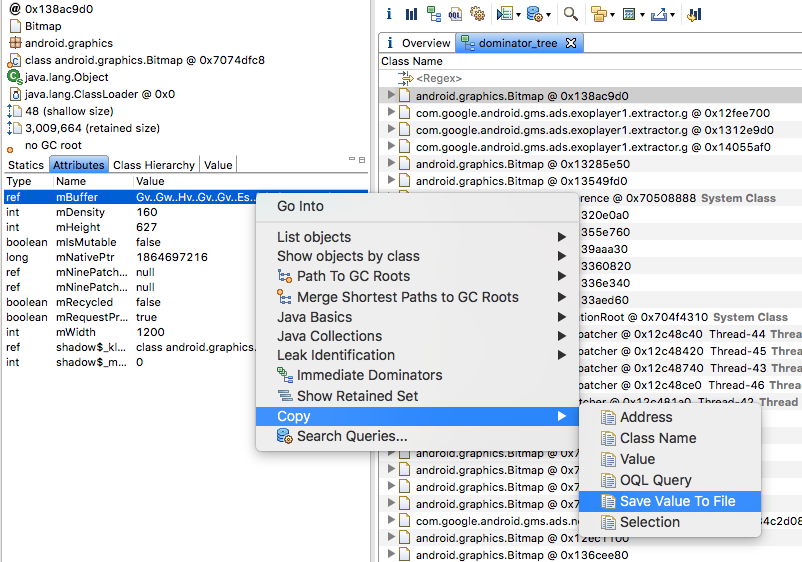
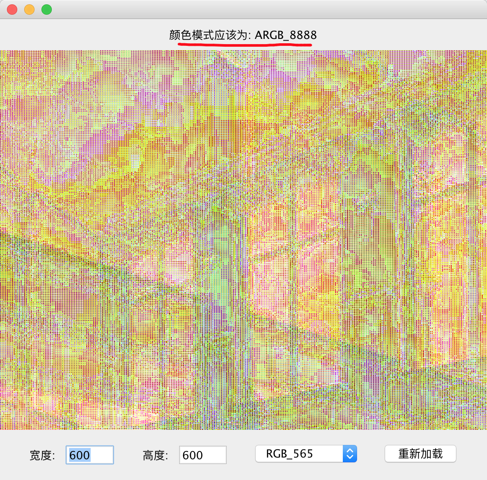
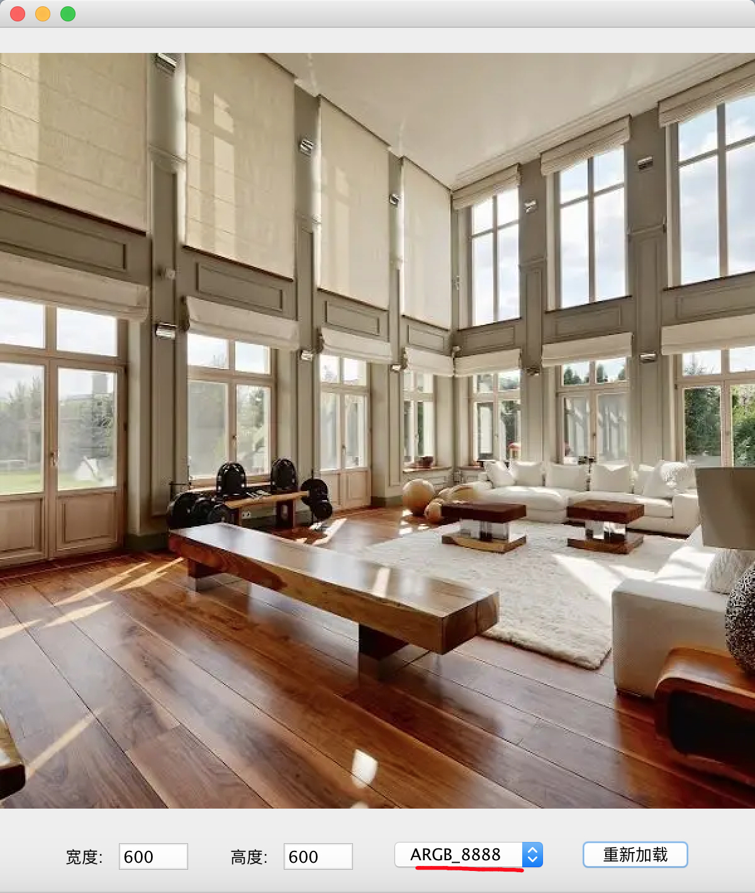

# Bitmap Preview 

> Bitmap Preview 用于预览从MAT中导出的Bitmap的 mBuffer 数据, 也就是预览原始的位图数据. 目前常用的方案是通过GIMP打开 , 
具体方式可以参考[这篇文章](http://wangjunyan.github.io/2014/12/02/two-tips-of-eclipse-memory-analyzer/) .

> Bitmap Preview 是另外一种简单、轻量级的Bitmap原始数据预览方案. 通过运行 jar 文件加载Bitmap图片, 在加载图片时会检查Bitmap原始数据以及用户设定的
图片宽高是否正确, 如果不正确则给出相应的提示.
 

## 一、使用示例

从这里下载 [bitmap-preview-1.0.jar](./bitmap-preview-1.0.jar)

### 1.1 从 MAT 中导出Bitmap原始位图数据

MAT中导出的Bitmap mBuffer数据, 具体操作为:     

1. 在MAT中选定要查看的Bitmap, 在Inspector窗口查看Bitmap对象的Attributes，
其中mBuffer为Bitmap像素数据，mHeight和mWidth为Bitmap的高度和宽度。    
2. 右键mBuffer并在弹出的菜单中选择`”Copy”->”Save Value To File”`, 将这个字节数组的值保存到文件中, 命名规则为: `宽度x高度.rgba` 或者 `宽度x高度.rgb` . 其中RGBA表示图片每个像素含有红、绿、蓝、透明度四个通道, 而RGB只有红、绿、蓝三个通道. 

如图所示:     

例如上图中的图片宽度为 1200, 高度为 627, 因此我们可以保存为 上面的`1200x627.rgba`.

如果在导出Bitmap mBuffer数据时不知道图片是RGBA 还是 RGB, 那么可以随便写一个, 在使用 Bitmap preview 打开时会自动检测图片的颜色模式, 如果颜色模式不正确, Bitmap preview 会给出相应的提示, 到时候修改为正确的模式再重新加载即可. 下面的1.2 章节会有说明.

### 1.2 预览Bitmap位图数据

例如有一张 600x600的RGBA 图片, 我们通过MAT导出时并不知道它是 RGBA 还是RGB, 因此我们直接保存为 600x600.rgb, 然后通过一下命令打开: 

`java -jar bitmap-preview.jar ~/Desktop/600x600.rgb` , 由于这张图片的颜色模式是RGBA, 因此bitmap preview 解码时会出现错误. 此时会给出相应的提示,
如图所示: 

 

然后我们根据顶部的提示, 在窗口底部将颜色模式修改为 `ARGB_8888` (也就是Android 中Bitmap的ARGB_8888), 然后重新加载即可. 如图所示: 

  